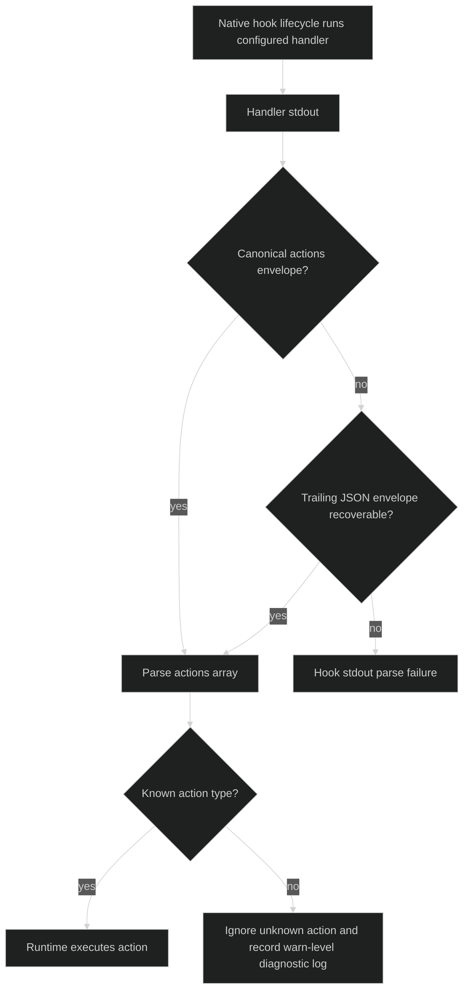
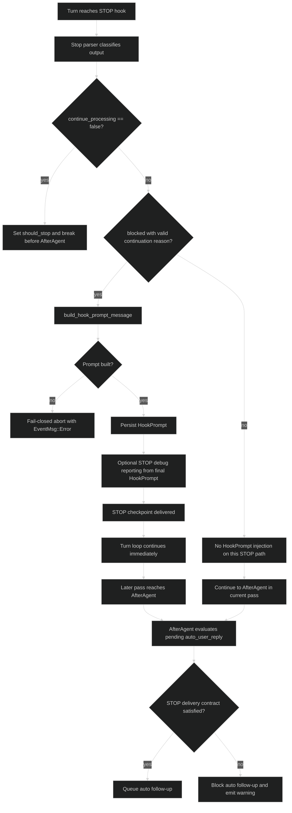
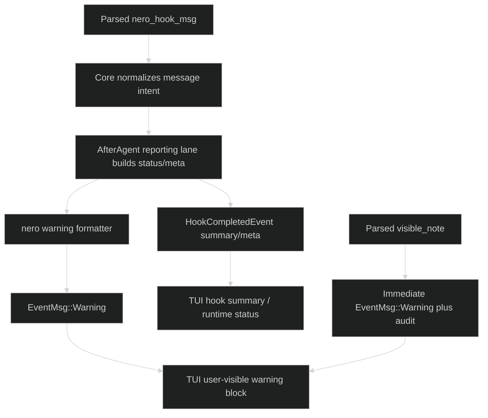
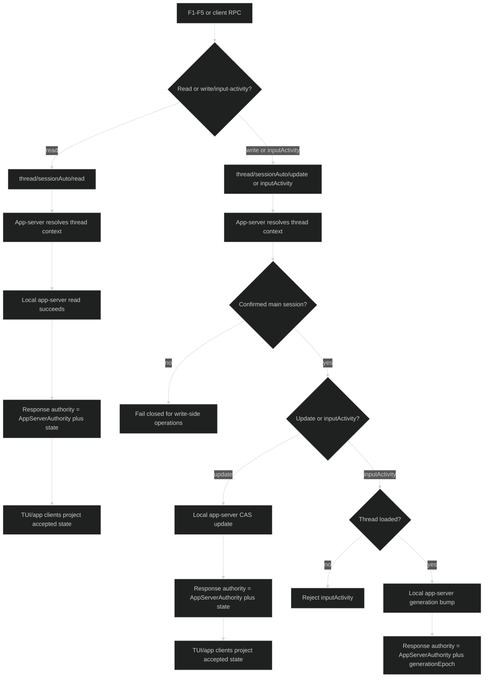
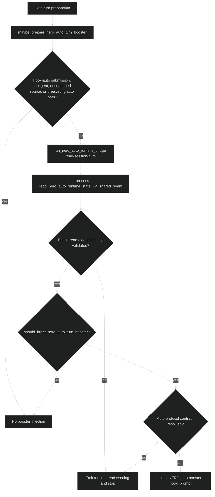
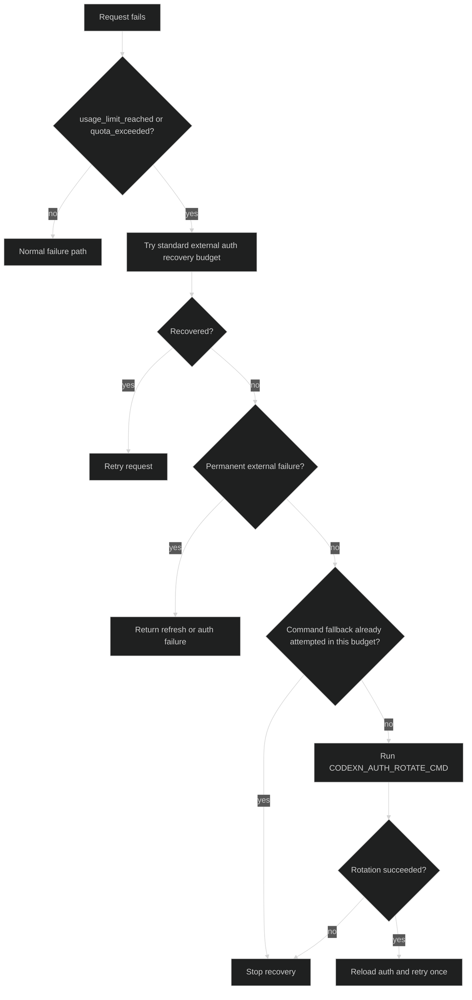
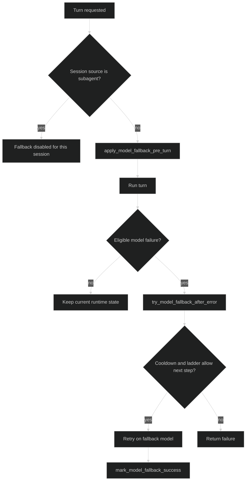

# Codex-rs Fork Guide

Cel: jasna dokumentacja samej warstwy `codex-rs` w forku Nero, bez mieszania jej z szerszym systemem `codex-nero-sdk` i `nerobar-ui`.

Ten dokument opisuje:

1. główne capability widziane z perspektywy użytkownika i operatora,
2. główne elementy wewnętrzne forka w `codex-rs`,
3. API/kontrakty eksportowane z `codex-rs`,
4. komunikację z `codex-nero-sdk` i punkty integracji z upstream,
5. gdzie rozszerzać fork, jeśli chcemy dodawać nowe capability.

## 1. Zakres i zasada czytania

Ten dokument dotyczy tylko `codex-rs`.

To znaczy:

- opisuje, co fork dodał lub nadbudował w Rust runtime,
- opisuje, jakie kontrakty `codex-rs` wystawia na zewnątrz,
- nie próbuje dokumentować całego `codex-nero-sdk`,
- nie próbuje dokumentować całego `nerobar-ui`.

Powiązane dokumenty:

- `docs-nero-fork/final-spec-stop-centric.md`
  - szczegółowa specyfikacja lane `STOP` dla `hook auto` i runtime command injection
- `docs-nero-fork/codex-rs-fork-surface-atlas.md`
  - techniczna mapa surface’ów, modułów i kontraktów
- `docs-nero-fork/codex-rs-fork-api-sdk-router-seam.md`
  - precyzyjny suplement API/SDK seam (`tool -> router -> protocol -> replay -> TUI`) z mapą odpowiedzialności testów
- `docs-nero-fork/multiaccount-model-fallback-verified.md`
  - oddzielny, zweryfikowany opis `multiaccount` i `model fallback`

## 2. Szybka mapa capability

### 2.1 Hook Msg

User experience:

- użytkownik widzi komunikaty runtime związane z hookami,
- komunikaty mogą być skrótowe albo blokowe,
- komunikaty mogą być pokazywane w TUI i/lub w summary hooków,
- capability służy do jawnego przekazywania stanu runtime, a nie do ukrytego sterowania.

Główna rola w systemie:

- dostarczyć operatorowi czytelny komunikat o stanie runtime na surface user/TUI,
- zachować natywny transport hooków upstream, ale dodać forkową semantykę Nero.

Ważny caveat:

- żywa ścieżka `nero_hook_msg` jest w praktyce user/TUI-facing,
- subagentowe sesje są odcinane od lane `msg/auto`,
- jedyną hookową akcją, która pozostaje aktywna także dla subagenta, jest `visible_note`.

Najważniejsze nośniki:

- `nero_hook_msg` w `actions[]`,
- `EventMsg::Warning`,
- `HookCompletedEvent` z meta/entries.

### 2.2 Hook Auto

User experience:

- system może po odpowiedzi agenta zdecydować, czy wykonać jeszcze jeden automatyczny krok,
- decyzja jest deterministyczna i oparta o jawny protokół JSON,
- jeżeli kontrakt dostawy nie jest spełniony, auto nie rusza dalej,
- użytkownik dostaje status, czy auto kontynuuje, czy zostało zablokowane.

Główna rola w systemie:

- utrzymać stop-centric auto loop,
- nie używać `developer_instructions` jako kanału runtime command,
- robić auto-kontynuację tylko przy spełnionym kontrakcie.

Ważny caveat:

- lane `auto_user_reply` jest tłumiony dla sesji subagentowych,
- dokumentując ten mechanizm, trzeba go traktować jako path dla potwierdzonych main-session, nie jako ogólny hook transport dla każdego agenta.

Najważniejsze nośniki:

- `auto_user_reply` w `actions[]`,
- `STOP` hook,
- `HookPrompt`,
- meta stop checkpoint delivery contract.

### 2.3 Runtime Session-Auto Control

User experience:

- operator może zmieniać runtime parametry auto w bieżącej sesji,
- hotkeye F1-F5 dają jawny, szybki sterownik w TUI,
- app-server wystawia authority-backed ścieżkę odczytu, input-activity i update,
- TUI pokazuje, co zostało rzeczywiście przyjęte.

Główna rola w systemie:

- rozdzielić sterowanie runtime od samego wykonania tury,
- utrzymać jedną authority path dla zmian sesyjnych,
- obsługiwać konflikt wersji i sesyjną spójność.

Najważniejsze nośniki:

- `thread/sessionAuto/read`,
- `thread/sessionAuto/inputActivity`,
- `thread/sessionAuto/update`,
- pole protokołu `nero_auto_runtime`,
- oraz węższy shared-seam bridge read używany przez core booster.

### 2.4 Multiaccount / Auth Rotation

User experience:

- przy `usage_limit_reached` lub `quota_exceeded` runtime może spróbować odzyskać działanie,
- najpierw przez standardowy recovery flow,
- a dopiero przy ścieżce transient/no-external przez jawnie podane zewnętrzne polecenie rotacji konta/auth,
- po sukcesie request jest podejmowany ponownie.

Główna rola w systemie:

- zwiększyć odporność sesji na limity konta,
- nie mieszać tej capability z `hook auto`,
- utrzymać oddzielny, jawny kanał odzyskiwania auth.

Ważny caveat:

- command fallback jest wykonywany najwyżej raz na aktywny recovery budget,
- nowy request/reset budżetu może otworzyć kolejną próbę.

Najważniejsze nośniki:

- `CODEXN_AUTH_ROTATE_CMD`,
- `CODEXN_AUTH_ROTATE_CMD_TIMEOUT_MS`,
- `CODEXN_ROTATION_REASON`.

### 2.5 Model Fallback

User experience:

- jeśli model zawiedzie w kwalifikowany sposób, runtime może przełączyć się na kolejny model z drabinki,
- fallback ma własny config, cooldown i opcjonalny sticky behavior,
- to capability jest oddzielone od multiaccount i od auto loopa.

Główna rola w systemie:

- odzyskać wykonanie tury przy wybranych awariach modelu,
- zachować kontrolowaną drabinkę modeli,
- nie mieszać fallbacku modelu z fallbackami semantyki runtime.

Ważny caveat:

- fallback jest celowo wyłączany dla sesji `SubAgent`,
- to jest polityka capability, a nie luka implementacyjna.

Najważniejsze nośniki:

- `[nero.model_fallback]`,
- ladder/cooldown/sticky,
- runtime state w sesji.

### 2.6 Model Catalog Runtime Overlay

User experience:

- operator może dodać albo nadpisać definicje modeli bez przebudowy binarki,
- baza pozostaje bundled `codex-rs/core/models.json`,
- lokalny overlay jest ładowany na starcie i wygrywa nad bundled/cache/remote dla tych samych `slug`,
- nowe modele z overlay trafiają do `model/list` i TUI picker, jeżeli mają widoczność/listowalność zgodną z `ModelInfo`.

Główna rola w systemie:

- umożliwić szybkie przyjęcie nowych definicji modeli lub upstream metadata bez pełnego update'u forka,
- zachować normalny cache/remote refresh dla modeli nieobjętych overlay,
- przenieść kontrolę nad `ModelInfo`, w tym `instructions`, `model_messages`, capability flags i reasoning metadata, do lokalnego pliku JSON.

Ważny caveat:

- `model_catalog_json` to pełne replacement i nie może być łączone z overlay,
- `model_catalog_overlay_json` jest startup-only; MVP nie ma hot reload,
- overlay musi mieć pełny kształt `ModelsResponse`, taki jak `codex-rs/core/models.json`.

Najważniejsze nośniki:

- `model_catalog_overlay_json = "/abs/path/models.overlay.json"`,
- `model_catalog_json = "/abs/path/models.json"` jako pełny replacement,
- `ModelsManager` merge: bundled -> cache/remote -> overlay.

### 2.7 STOP Hook Debug Reporting

User experience:

- operator może włączyć jawne dev/debug logowanie tego, co `STOP` faktycznie wstrzyknął do agenta,
- poziom `summary` pokazuje, że wysłano prompt,
- poziom `full` pokazuje realnie dostarczone fragmenty,
- capability nie dotyczy wszystkich hooków, tylko ścieżki `STOP -> HookPrompt`.

Główna rola w systemie:

- dać jawność w najbardziej krytycznej ścieżce runtime command,
- logować realne zdarzenie po persistence `HookPrompt`, a nie etap wstępny.

Najważniejsze nośniki:

- `nero.hook.runtime.stop.debug.hook_prompt_reporting`,
- `EventMsg::Warning`,
- finalny, sparsowany `HookPrompt`.

## 3. Główne elementy forka w `codex-rs`

Poniżej są główne elementy, które tworzą właściwy fork runtime w Rust.

### 3.1 Hook action parsing layer

To jest warstwa, która przyjmuje zewnętrzne `actions[]` i zamienia je na forkowe działania runtime.

Najważniejsze miejsca:

- `codex-rs/hooks/src/response.rs`
- `codex-rs/hooks/src/user_notification.rs`

To tutaj istnieją aktywne typy action:

- `nero_hook_msg`
- `auto_user_reply`
- `visible_note`

Ta warstwa jest granicą między dowolnym skonfigurowanym handlerem hooków a `codex-rs`.

Ważny caveat:

- parser jest celowo częściowo permissive,
- ignoruje nieznane typy action,
- ma compatibility recovery dla hooków, które emitują plaintext przed końcową linią JSON,
- więc ten kontrakt jest stabilnym kanałem wire, ale nie jest parserem „strict exact bytes in -> exact semantic failure”.

### 3.2 Stop-centric command lane

To jest najważniejszy lane runtime command dla auto i dla prompt injection do agenta.

Najważniejsze miejsca:

- `codex-rs/hooks/src/events/stop.rs`
- `codex-rs/core/src/codex.rs`
- `codex-rs/protocol/src/items.rs`

To tutaj:

- `STOP` hook może zwrócić `continuation_fragments`,
- z nich budowany jest natywny `HookPrompt`,
- po skutecznym zapisaniu `HookPrompt` runtime może wejść w kolejny obieg.

To jest osobny mechanizm od:

- `AfterCompaction`,
- `SessionStart`,
- `UserPromptSubmit`.

### 3.3 After-agent reporting lane

To jest głównie lane raportowania i podsumowania, ale nie jest wyłącznie pasywnym logowaniem.

Najważniejsze miejsca:

- `codex-rs/core/src/codex.rs`
- `codex-rs/tui/src/chatwidget.rs`

To tutaj:

- zbierane są statusy runtime,
- budowane są summary/meta,
- emitowane są warningi i podsumowania dla użytkownika.
- przetwarzane są też `auto_user_reply` oczekujące na spełnienie kontraktu dostawy STOP.

Ta warstwa współpracuje z `hook msg` i `hook auto`, ale nie zastępuje `STOP`.

Najważniejszy caveat:

- `AfterAgent` nie jest głównym lane `runtime command injection`,
- ale nadal może zmaterializować kolejny auto-follow-up, jeśli `STOP` wcześniej dostarczył checkpoint i kontrakt został spełniony,
- więc należy go traktować jako reporting lane z kontrolowanym skutkiem follow-up, a nie jako całkowicie bierny logger.

### 3.4 Session-auto authority lane

To jest osobny subsystem do kontroli runtime parametrów aktywnej sesji.

Najważniejsze miejsca:

- `codex-rs/app-server/src/thread_session_auto.rs`
- `codex-rs/app-server/src/codex_message_processor.rs`
- `codex-rs/app-server-protocol/src/protocol/v2.rs`
- `codex-rs/core/src/nero_auto_runtime_state.rs`
- `codex-rs/tui/src/app.rs`
- `codex-rs/tui/src/chatwidget.rs`

To tutaj żyją:

- odczyt stanu sesji,
- input-activity dla kasowania/countdown safety,
- update stanu sesji,
- wersjonowanie update’ów,
- authority mode,
- projekcja do TUI,
- hotkeye F1-F5.

Ważne caveaty:

- read pozostaje dozwolony także dla sesji niepewnych i subagentowych, żeby runtime mógł pokazać stan,
- write-side lane (`update` oraz `inputActivity`) jest fail-closed dla sesji subagentowych i niepewnych,
- włączenie auto może zostać odrzucone, jeśli kontrakt dostawy `runtime_msg` nie może być spełniony, na przykład przy braku `thread_name`.

### 3.5 Recovery lane: multiaccount / auth rotation

To jest niezależny recovery lane po stronie klienta modelu.

Najważniejsze miejsce:

- `codex-rs/core/src/client.rs`

To capability:

- nie używa hooków,
- nie używa app-server session-auto authority,
- nie jest częścią `STOP` lane.

### 3.6 Model fallback lane

To jest niezależny lane sterowania modelem.

Najważniejsze miejsca:

- `codex-rs/core/src/config/mod.rs`
- `codex-rs/core/src/codex.rs`
- `codex-rs/core/src/state/session.rs`

To capability:

- żyje w config + runtime state sesji,
- działa przed turą i po kwalifikowanym błędzie tury,
- ma własne reguły i telemetrykę.

## 4. API i kontrakty eksportowane z `codex-rs`

To są najważniejsze dodatkowe kontrakty, które fork wystawia z warstwy Rust.

### 4.1 Hook action wire contract

To jest podstawowy kontrakt `codex-rs` dla akcji hookowych emitowanych przez skonfigurowane handlery hooków.

Forma:

- envelope `{"actions":[...]}`

Aktywne typy:

- `nero_hook_msg`
- `auto_user_reply`
- `visible_note`

Znaczenie:

- zewnętrzny handler hooka kompozuje,
- `codex-rs` parsuje, normalizuje i wykonuje.

Caveat:

- `codex-nero-sdk` jest ważnym producentem tego envelope w naszym forkowym ekosystemie,
- ale `codex-rs` nie zakłada na poziomie parsera, że producentem musi być akurat SDK.

### 4.2 STOP HookPrompt injection contract

To jest kontrakt specjalny dla `STOP`.

Elementy:

- `continuation_fragments`,
- finalny `HookPrompt`,
- dostarczenie do historii rozmowy,
- dalszy obieg modela tylko po sukcesie.

To jest główna ścieżka runtime command do agenta w forkowym lane `hook auto`.

### 4.3 Session-auto RPC

To jest jawne API sesyjne dla kontroli auto runtime.

Metody:

- `thread/sessionAuto/read`
- `thread/sessionAuto/inputActivity`
- `thread/sessionAuto/update`

Nośniki:

- request/response przez app-server,
- `threadId`,
- `authority`,
- `expectedVersion`,
- `expectedSessionSource?`,
- merge-patch nullable overrides:
  - `enabled`
  - `autonomyLevel`
  - `autonomyStepPerRound`
  - `maxAutoRounds`
  - `doneStopScope`
  - `autoRounds`
- `resetCounter`,
- `state` dla `read` i `update`,
- `generationEpoch` dla `inputActivity`.

Semantyka wire:

- dla pól override omission oznacza „zostaw bez zmian”,
- `null` oznacza „wyczyść override”,
- `resetCounter` jest zwykłym boolem i jest konsultowany wtedy, gdy `autoRounds` nie jest podane,
- `inputActivity` ma dziś jeden aktywny kind: `DraftChanged`,
- `inputActivity` wymaga w aktywnej implementacji loaded thread, który jest jednocześnie confirmed main session.

To jest najważniejsze zewnętrzne API forkowe po stronie sesyjnej.

### 4.4 Protocol session field

Fork rozszerza sesyjną warstwę protokołu o:

- `nero_auto_runtime`

To pozwala przenosić runtime state przez aktualizacje sesji i projekcję do TUI/app-server.

### 4.5 Config/env ingress

Najważniejsze wejścia config/env:

- `CODEXN_ROOT`
- `CODEXN_CONFIG_NERO_PATH`
- `CODEXN_CONFIG_NERO_MSG_PATH`
- `CODEXN_CONFIG_NERO_AUTO_PATH`
- `CODEXN_CONFIG_NERO_DEV_PATH`
- `CODEXN_CONFIG_NERO_MERGE_PATHS`
- `CODEXN_AUTH_ROTATE_CMD`
- `CODEXN_AUTH_ROTATE_CMD_TIMEOUT_MS`
- `NERO_RUNTIME_STATE_CONTROL_CWD`
- `NERO_RUNTIME_STATE_CONTROL_MODULE`
- `NERO_RUNTIME_CONTROL_TIMEOUT_MS`
- `NERO_RUNTIME_PYTHON_BIN`
- kompatybilne aliasy:
  - `NEROBAR_NERO_RUNTIME_STATE_CONTROL_CWD`
  - `NEROBAR_NERO_RUNTIME_STATE_CONTROL_MODULE`
  - `NEROBAR_NERO_RUNTIME_CONTROL_TIMEOUT_MS`
  - `NEROBAR_NERO_RUNTIME_PYTHON_BIN`

To są jawne granice integracyjne, nie przypadkowe zmienne pomocnicze.

## 5. Komunikacja `codex-rs` z `codex-nero-sdk`

To jest najważniejszy opis naszego „codex-rs SDK boundary”.

### 5.1 Hook router boundary

Model komunikacji:

1. upstream/native hook lifecycle wywołuje hook runtime,
2. kompatybilna ścieżka notify trafia do zewnętrznego routera,
3. zewnętrzny router/handler buduje `actions[]`,
4. `codex-rs` parsuje je i wykonuje.

Z punktu widzenia `codex-rs` oznacza to:

- Rust nie decyduje o wysokopoziomowej kompozycji organizerowej,
- Rust jest miejscem ostatecznego wykonania i renderowania,
- kontrakt między repozytoriami musi być stabilny i jawny.

### 5.2 Session-auto authority boundary

Druga główna granica to session-auto control, ale trzeba ją rozumieć precyzyjnie.

Model komunikacji:

1. TUI albo app-server chce odczytać/zmienić runtime auto,
2. app-server lokalnie rozwiązuje kontekst sesji (`thread id`, `session_source`, `main_session_confirmed`),
3. `thread/sessionAuto/read`, `thread/sessionAuto/inputActivity` i `thread/sessionAuto/update` są obsługiwane lokalnie przez app-server,
4. ich wynik wraca do TUI i innych klientów jako app-server response:
   - `read` i `update` niosą `authority` oraz `state`,
   - `inputActivity` niesie `authority`, `applied` i `generationEpoch` bez pola `state`,
5. osobno istnieje węższy shared-seam bridge read dla core auto-booster path.

To jest inny kanał niż `actions[]`.

Czyli:

- hook action channel i session-auto authority channel to dwa różne interfejsy,
- nie wolno ich mieszać w dokumentacji ani w implementacji.

Ważne doprecyzowanie:

- dokumentacja nie powinna sugerować, że bieżący `thread/sessionAuto/read|update` jest przez default wykonywany przez zewnętrzny bridge apply flow,
- w aktywnej implementacji to jest lane lokalny app-server,
- bridge seam pozostaje pomocniczym, węższym mechanizmem używanym przez core do `read-session-auto`.

## 6. Punkty integracji z upstream

To jest krytyczne, bo fork nie żyje obok upstream, tylko na jego lifecycle.

### 6.1 Native hook engine

Fork opiera się na:

- `HookEventName::Stop`
- `HookEventName::AfterAgent`
- `HookEventName::AfterCompaction`

Znaczenie:

- fork nie zastępuje hook engine,
- fork dopina się do natywnych checkpointów i carrierów.

### 6.2 Native event carriers

Fork używa natywnych carrierów do projekcji user-visible:

- `EventMsg::Warning`
- `HookCompletedEvent`

Znaczenie:

- nie tworzymy osobnej, równoległej szyny eventowej,
- dokładamy forkową semantykę na natywnych nośnikach.

### 6.3 Native TUI / app-server shells

Fork wykorzystuje natywne:

- TUI event loop,
- app-server RPC,
- session update stream,
- thread lifecycle.

Znaczenie:

- capability forka muszą być projektowane jako nadbudowa, nie drugi runtime.

## 7. Serwisy pomocnicze i moduły wspólne

To są pomocnicze elementy forkowej architektury, które nie są same capability, ale bez nich system nie jest utrzymywalny.

### 7.1 Config resolution

Najważniejsze miejsce:

- `codex-rs/core/src/config/mod.rs`

Rola:

- czytanie overlayów Nero,
- składanie efektywnego configu,
- walidacja configu forkowych capability.

### 7.2 Runtime state normalization

Najważniejsze miejsce:

- `codex-rs/core/src/nero_auto_runtime_state.rs`

Rola:

- normalizacja sesyjnego stanu auto,
- wersjonowanie i read/write state,
- helpery authority/session-source.
- parse i projection configowych trybów debug/reporting dla hook runtime.

### 7.3 TUI projection

Najważniejsze miejsca:

- `codex-rs/tui/src/chatwidget.rs`
- `codex-rs/tui/src/app.rs`

Rola:

- pokazanie użytkownikowi runtime stanu,
- hotkeye,
- status line,
- countdown i feedback po zmianach runtime.

### 7.4 Core orchestration

Najważniejsze miejsce:

- `codex-rs/core/src/codex.rs`

Rola:

- miejsce, gdzie wszystkie capability ostatecznie spotykają się z turn lifecycle,
- tu zapada decyzja o wykonaniu skutku runtime, nie w dokumentach i nie w samym SDK.

## 8. Jak rozszerzać fork dalej

Jeżeli chcemy dodać nowe capability do samego `codex-rs` forka, to warto trzymać się tego porządku:

1. najpierw ustalić, czy to jest capability `codex-rs`, czy capability `codex-nero-sdk`,
2. jeśli to `codex-rs`, ustalić jego carrier:
   - hook action,
   - `STOP HookPrompt`,
   - pre-turn auto booster,
   - app-server RPC,
   - session protocol field,
   - TUI-only projection,
3. nie mieszać różnych rodzin mechanizmów pod jednym “loggerem” lub jednym “kanałem”,
4. dokumentować osobno:
   - user outcome,
   - external contract,
   - runtime ownership,
   - upstream dependency.

Najważniejsza praktyczna zasada:

- `STOP`, `AfterAgent`, `AfterCompaction`, app-server session-auto RPC, shared-seam bridge read helper i recovery auth to nie jest jeden wspólny kanał.
- Każdy z tych lane’ów ma własny carrier, własną semantykę i własne ryzyka.

## 9. Co dziś jest kluczowym rdzeniem forka

Jeżeli ktoś ma zrozumieć fork szybko, to powinien znać te elementy jako rdzeń:

1. `hook msg`
2. `hook auto`
3. session-auto authority / runtime controls
4. multiaccount / auth rotation
5. model fallback
6. user-visible reporting lane
7. `STOP` debug reporting

To jest praktyczny rdzeń forka `codex-rs` na dziś.

## 10. Najkrótsza konkluzja

`codex-rs` w forku Nero nie jest “wszystkim naraz”.

To jest warstwa wykonawcza i kontraktowa, która:

- przyjmuje akcje i decyzje z zewnątrz,
- egzekwuje je w natywnym runtime,
- wystawia jawne kontrakty sesyjne i hookowe,
- i utrzymuje główne capability runtime potrzebne do działania Nero bez przepisywania całego upstreamu.

## 11. Kluczowe flowcharty

Poniższe diagramy dokumentują realne kanały aktywne dziś w forku.

### 11.1 Hook action parsing i wykonanie

### 11.2 STOP lane: command injection i auto request

### 11.3 Hook Msg / user-visible reporting

### 11.4 Session-auto authority lane

### 11.5 Shared-seam auto booster read

### 11.6 Multiaccount / auth rotation

### 11.7 Model fallback

