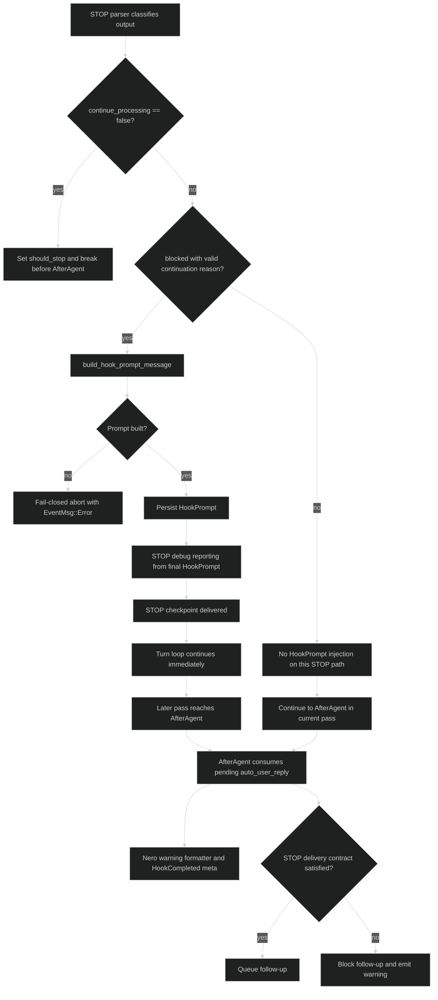
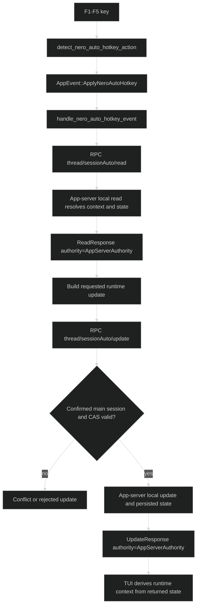
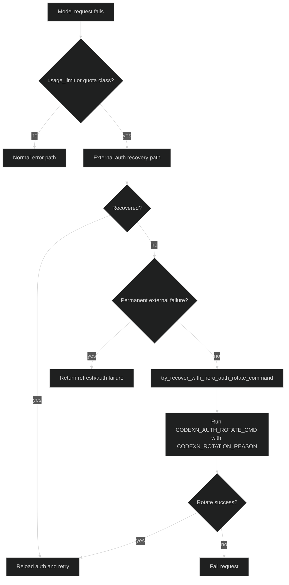
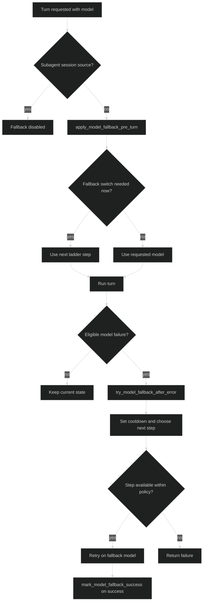

# Codex-rs Fork Surface Atlas

Purpose: authoritative, current map of fork-owned `codex-rs` capability surfaces and the external contracts exposed from `codex-rs`.

Companion doc:

- `docs-nero-fork/codex-rs-fork-guide.md`
  - higher-level guide for capability intent, user experience, helper services, and extension boundaries

## Ownership Legend

- `NATIVE`: upstream Codex/runtime surface that Nero depends on but does not own.
- `NERO-INTERNAL`: fork-owned implementation/state internal to `codex-rs`.
- `NERO-EXPOSED`: fork-owned typed/stable contract exported from `codex-rs` (wire, RPC, protocol field, env/config interface).
- `NERO-DIAGNOSTIC`: fork-owned diagnostic/user-visible payload convention carried on native surfaces, but not versioned as typed public API.
- `EXTERNAL-CONSUMER`: system outside `codex-rs` consuming exposed contracts (for this map: `codex-nero-sdk`, `nerobar-ui`, operator command surface).

## Top-Level Capability Matrix

| Surface | Primary outcome | Ownership | Primary carriers | Primary modules |
| --- | --- | --- | --- | --- |
| Hook Msg | Runtime msg composition and delivery decisions for turn lifecycle | `NERO-EXPOSED` + `NERO-INTERNAL` on `NATIVE` hooks | `NeroHookAction::NeroHookMsg`, hook action envelope | `hooks/src/response.rs`, `core/src/codex.rs`, `hooks/src/user_notification.rs` |
| Hook Auto | Stop-centric auto continuation decision and enqueue contract | `NERO-EXPOSED` + `NERO-INTERNAL` on `NATIVE` STOP | `NeroHookAction::AutoUserReply`, stop checkpoint contract meta | `hooks/src/response.rs`, `core/src/codex.rs`, `tui/src/chatwidget.rs` |
| User-visible warning/reporting lane | User-visible runtime status and warning rendering | Carrier `NATIVE`, formatter/control `NERO-INTERNAL`, output `NERO-DIAGNOSTIC` | `EventMsg::Warning`, `HookCompletedEvent`, nero warning formatter/delivery | `core/src/codex.rs`, `tui/src/chatwidget.rs` |
| Session-auto authority / F1-F5 | Runtime auto parameter changes through authority path | `NERO-EXPOSED` + `NERO-INTERNAL` on native app-server RPC and session protocol surfaces | F1-F5 hotkeys, app-server `thread/sessionAuto/*`, protocol `nero_auto_runtime` | `tui/src/chatwidget.rs`, `tui/src/app.rs`, `app-server/src/codex_message_processor.rs`, `app-server/src/thread_session_auto.rs`, `app-server-protocol/src/protocol/v2.rs` |
| Pre-turn auto booster | Read session-auto state, resolve auto contract, and inject a pre-turn hook prompt when runtime policy allows it | `NERO-INTERNAL` on shared-seam read + `NATIVE` prompt injection carrier | `read-session-auto`, auto contract resolver, `HookPrompt` injection | `core/src/codex.rs`, `core/src/config/mod.rs` |
| Dynamic account switching / auth rotation | Recovery from quota/usage-limit through controlled rotate command path | `NERO-EXPOSED` + `NERO-INTERNAL` | `CODEXN_AUTH_ROTATE_CMD*`, `CODEXN_ROTATION_REASON` | `core/src/client.rs` |
| Model fallback | Controlled model ladder switching on eligible model failures | `NERO-EXPOSED` config + `NERO-INTERNAL` runtime state | `[nero.model_fallback]`, fallback runtime state/methods | `core/src/config/mod.rs`, `core/src/codex.rs`, `core/src/state/session.rs` |
| Native hook dependency surfaces | Native lifecycle checkpoints and completion summary used by Nero capabilities | `NATIVE` | `HookEventName::{Stop, AfterAgent, AfterCompaction}`, `HookCompletedEvent` | `protocol/src/protocol.rs`, runtime hook dispatch in `core/src/codex.rs` |
| Runtime/config authority boundary | External control/config ingress and narrower shared-seam helper boundary | `NERO-EXPOSED` + `NERO-INTERNAL` | app-server RPC, protocol session fields, env/config overlays, bridge helper module | `app-server/src/thread_session_auto.rs`, `core/src/config/mod.rs`, `core/src/codex.rs`, `protocol/src/protocol.rs` |

## Detailed Surfaces

### 1) Hook Msg

- Purpose: carry structured runtime messaging decisions from hook action output into agent/user delivery flow.
- Active modules:
  - `codex-rs/hooks/src/response.rs`
  - `codex-rs/hooks/src/user_notification.rs`
  - `codex-rs/core/src/codex.rs`
- Active Rust symbols:
  - `NeroHookAction::NeroHookMsg`
  - `NeroHookMsgMode`, `NeroHookMsgShow`, `NeroHookMsgContent`, `NeroHookMsgFormat`, `NeroHookMsgStatus`
  - `parse_nero_hook_actions_from_stdout(...)`
- External inputs:
  - Hook action envelope `{"actions":[...]}`
  - Action wire `type: "nero_hook_msg"`
  - Mode values: `"synced"`, `"tui-short"` (`"tui_short"` alias accepted)
  - Format values: `"block"`, `"inline"`
- External outputs:
  - Runtime-applied msg action in after-agent processing for confirmed main-session delivery lanes
  - User-visible status blocks and/or summary entries through the reporting lane
- Runtime state ownership:
  - Turn-local delivery counters and status assembly in `core/src/codex.rs`
- Native dependencies:
  - Hook lifecycle events and native summary/event transport
- External consumers:
  - `codex-nero-sdk` (producer via hook output contract)
  - TUI/user surface (consumer of rendered result)
- Branding status:
  - Capability symbols are branded (`Nero*`, `nero_*`)
- Confirmed residues:
  - none for this surface in current active path
- Parsing caveats:
  - parser ignores unknown action types instead of failing the whole envelope
  - parser can recover a trailing canonical JSON envelope if hook stdout prefixed plaintext log lines
  - malformed known actions can still fail parse; the channel is stable but not strict “exact bytes” identity
- Delivery caveats:
  - subagent sessions suppress the active `msg/auto` lane
  - `visible_note` remains the only hook action that still emits directly for subagent-visible warning delivery

### 2) Hook Auto

- Purpose: stop-centric auto continuation control based on strict hook output and delivery contract.
- Active modules:
  - `codex-rs/hooks/src/response.rs`
  - `codex-rs/core/src/codex.rs`
  - `codex-rs/tui/src/chatwidget.rs`
- Active Rust symbols:
  - `NeroHookAction::AutoUserReply`
  - stop contract meta assembly in `core/src/codex.rs` (`stop_checkpoint_expected`, `stop_checkpoint_delivered`, `contract_satisfied`)
- Exact external inputs:
  - Hook action `type: "auto_user_reply"`
  - STOP hook lifecycle checkpoint
- Exact external outputs:
  - Auto user reply enqueue decision path
  - Diagnostic hook completion metadata consumed by TUI (`protocol.stop_checkpoint_expected`, `protocol.stop_checkpoint_delivered`)
- Runtime state ownership:
  - Session runtime config + turn-local follow-up counters in `core/src/codex.rs`
- Native dependencies:
  - `HookEventName::Stop`
  - `HookCompletedEvent`
- External consumers:
  - TUI status rendering
  - downstream runtime continuation behavior
- Branding status:
  - Branded action and stop-centric meta naming are active
- Confirmed residues:
  - none in active `msg/auto` action set
- Delivery caveats:
  - `auto_user_reply` is ignored for subagent session sources
  - duplicate `auto_user_reply` actions in the same turn are ignored after the first selected action

### 3) User-visible warning/reporting lane

- Purpose: render fork runtime status/messages to the user without changing native event carriers.
- Active modules:
  - `codex-rs/core/src/codex.rs`
  - `codex-rs/tui/src/chatwidget.rs`
- Active Rust symbols:
  - `nero_hook_tui_warning_message(...)`
  - `nero_hook_tui_delivery(...)`
  - `NeroHookAction::VisibleNote`
- Exact external inputs:
  - Hook action `type: "visible_note"`
  - Hook runtime status/meta produced in after-agent path for the summary/reporting branch
- Exact external outputs:
  - direct `EventMsg::Warning(WarningEvent { message })` for `visible_note`
  - `HookCompletedEvent` entries/meta shown in TUI for the after-agent reporting branch
- Runtime state ownership:
  - Core owns composition and emission; TUI owns projection/render state
- Native dependencies:
  - `EventMsg::Warning`
  - `HookCompletedEvent`
- External consumers:
  - User/TUI
- Branding status:
  - Nero formatter/delivery functions are branded; carriers remain native by design
- Confirmed residues:
  - none required for active behavior
- Flow caveat:
  - `visible_note` does not travel through after-agent status/meta assembly before warning emission
  - it emits warning + audit directly in the hook action application path
- Stability caveat:
  - warning text and hook summary `meta` are diagnostic payload conventions assembled in core
  - they are not schema-locked RPC/protocol contracts and should not be treated as versioned public API

### 4) Session-auto authority / F1-F5

- Purpose: deterministic runtime parameter updates through authority-backed session-auto controls.
- Active modules:
  - `codex-rs/tui/src/chatwidget.rs`
  - `codex-rs/tui/src/app.rs`
  - `codex-rs/app-server/src/codex_message_processor.rs`
  - `codex-rs/app-server/src/thread_session_auto.rs`
  - `codex-rs/app-server-protocol/src/protocol/v2.rs`
  - `codex-rs/protocol/src/protocol.rs`
- Active Rust symbols:
  - `detect_nero_auto_hotkey_action(...)`
  - `AppEvent::ApplyNeroAutoHotkey`
  - `handle_nero_auto_hotkey_event(...)`
  - `NeroThreadSessionAutoContext`
  - `NeroAutoBridgeReadRequest` (shared-seam read helper used by core booster path)
- External inputs:
  - F1-F5 key actions
  - RPC methods: `thread/sessionAuto/read`, `thread/sessionAuto/inputActivity`, `thread/sessionAuto/update`
  - update request contract:
    - required: `threadId`, `expectedVersion`
    - optional: `expectedSessionSource`
    - mutable runtime knobs:
      - nullable merge-patch fields: `enabled`, `autonomyLevel`, `autonomyStepPerRound`, `maxAutoRounds`, `doneStopScope`, `autoRounds`
      - plain bool field: `resetCounter`
    - omission keeps the current override, `null` clears the override
  - input-activity request contract:
    - `threadId`
    - `activity`, currently `DraftChanged`
    - active gate: loaded thread plus confirmed main session
  - read/update response contract carries `authority` and `state`
  - Protocol field: `nero_auto_runtime`
  - shared-seam bridge read module for core booster path: `nero_hook_runtime.session_auto_bridge`
- External outputs:
  - `ThreadSessionAutoReadResponse { thread_id, authority, state }`
  - `ThreadSessionAutoInputActivityResponse { thread_id, applied, authority, generation_epoch }`
  - `ThreadSessionAutoUpdateResponse { thread_id, authority, applied, conflict, message, error_code, reason_code, state }`
  - live read/update path currently returns `ThreadSessionAutoAuthorityMode::AppServerAuthority`
  - persisted session-auto state for later projection into runtime context on read/update paths
  - User-visible authority feedback in TUI
- Runtime state ownership:
  - Source of authority: app-server + protocol session state
  - Runtime application: persisted session-auto state later projected by TUI/core into runtime context
  - read path may also persist refreshed `main_session_confirmed` into the snapshot before returning
- Native dependencies:
  - Native app-server RPC transport
  - Native protocol event stream
- External consumers:
  - `nerobar-ui` backend
  - TUI runtime controls
- Branding status:
  - Authority/context/bridge symbols in this lane are branded
- Confirmed residues:
  - One retained compatibility alias inside bridge module resolution: retired module alias `nero_hook_runtime.state_runtime_control` (normalization only; active default remains `nero_hook_runtime.session_auto_bridge`)
  - Validation guard: app-server rejects empty `expectedVersion` on update requests
- Ownership caveats:
  - current `thread/sessionAuto/read|inputActivity|update` are handled locally inside app-server
  - the bridge/apply flow is not the primary active implementation for these RPC methods
  - shared-seam bridge read remains a narrower helper used by core auto-booster preparation

### 5) Dynamic account switching / auth rotation

- Purpose: recover from quota/usage-limit failures via explicit rotation command boundary.
- Active modules:
  - `codex-rs/core/src/client.rs`
- Active Rust symbols:
  - `try_recover_with_nero_auth_rotate_command(...)`
  - recovery flow around usage/quota handling in client request path
- Exact external inputs:
  - `CODEXN_AUTH_ROTATE_CMD`
  - `CODEXN_AUTH_ROTATE_CMD_TIMEOUT_MS`
  - recognized recovery reasons (`usage_limit_reached`, `quota_exceeded`)
- Exact external outputs:
  - child process invocation with `CODEXN_ROTATION_REASON`
  - auth reload + retry attempt if recovery succeeds
- Runtime state ownership:
  - model client session tracks recovery budget/attempt lifecycle
- Native dependencies:
  - upstream auth manager reload and API error classification
- External consumers:
  - operator-provided rotation command endpoint
- Branding status:
  - rotation entrypoint symbols are branded for fork-owned behavior
- Confirmed residues:
  - none in primary recovery path
- Policy caveats:
  - command fallback is one-shot per active recovery budget
  - a new request budget resets the command-attempt guard

### 6) Model fallback

- Purpose: move to ladder-defined backup models on eligible model failure conditions.
- Active modules:
  - `codex-rs/core/src/config/mod.rs`
  - `codex-rs/core/src/codex.rs`
  - `codex-rs/core/src/state/session.rs`
- Active Rust symbols:
  - `NeroModelFallbackConfig`, `NeroModelFallbackStep`, `NeroModelFallbackResolution`
  - `read_nero_model_fallback(...)`
  - `resolve_nero_model_fallback_from_env(...)`
  - `apply_model_fallback_pre_turn(...)`
  - `try_model_fallback_after_error(...)`
  - `mark_model_fallback_success(...)`
- Exact external inputs:
  - config namespace `[nero.model_fallback]`
  - keys: `enabled`, `cooldown_seconds`, `max_wait_seconds`, `sticky`, `ladder`
  - config overlay env entrypoints (Nero config overlay lane)
- Exact external outputs:
  - runtime model switch decisions prior to and after turn errors
  - fallback telemetry/audit entries in runtime path
- Runtime state ownership:
  - `NeroModelFallbackRuntimeState` in session state
- Native dependencies:
  - model turn execution and error handling loop
- External consumers:
  - runtime turn processing (internal consumer of config contract)
- Branding status:
  - capability and config/runtime symbols are branded
- Confirmed residues:
  - none required for active fallback behavior
- Policy caveats:
  - fallback is disabled for `SessionSource::SubAgent(_)`
  - this is a deliberate policy boundary, not an accidental omission

### 7) Native hook dependency surfaces

- Purpose: define the native lifecycle/checkpoint surfaces that Nero capabilities depend on.
- Active modules:
  - `codex-rs/protocol/src/protocol.rs`
  - `codex-rs/core/src/codex.rs`
- Active Rust symbols:
  - `HookEventName::{Stop, AfterAgent, AfterCompaction}`
  - `HookCompletedEvent`
- Exact external inputs:
  - Native lifecycle event dispatch from runtime hook engine
- Exact external outputs:
  - Standardized hook run summaries/events consumed by TUI and app-server pathways
- Runtime state ownership:
  - native runtime hook execution state
- Native dependencies:
  - this surface itself is native (dependency layer, not fork capability)
- External consumers:
  - Nero fork features (`hook msg`, `hook auto`, reporting lane)
- Branding status:
  - native names intentionally unchanged
- Confirmed residues:
  - none

### 8) Runtime/config authority boundary

- Purpose: govern where fork runtime behavior can be configured/updated from outside `codex-rs`.
- Active modules:
  - `codex-rs/core/src/config/mod.rs`
  - `codex-rs/core/src/codex.rs`
  - `codex-rs/app-server/src/thread_session_auto.rs`
  - `codex-rs/protocol/src/protocol.rs`
- Active Rust symbols:
  - Nero config resolver/read functions for fallback and auto runtime
  - bridge resolution/settings helpers in app-server thread session auto lane
- External inputs:
  - RPC: `thread/sessionAuto/read`, `thread/sessionAuto/inputActivity`, `thread/sessionAuto/update`
  - protocol session field: `nero_auto_runtime`
  - env/config ingress:
    - `CODEXN_ROOT` (bridge bootstrap/default cwd resolution)
    - `CODEXN_CONFIG_NERO_PATH`
    - `CODEXN_CONFIG_NERO_MSG_PATH`
    - `CODEXN_CONFIG_NERO_AUTO_PATH`
    - `CODEXN_CONFIG_NERO_DEV_PATH`
    - `CODEXN_CONFIG_NERO_MERGE_PATHS`
    - runtime default overrides:
      - `NERO_HOOK_AUTO_ENABLED`
      - `NERO_HOOK_AUTO_AUTONOMY_LEVEL`
      - `NERO_HOOK_AUTO_MAX_ROUNDS`
      - `NERO_HOOK_AUTO_STEP_PER_ROUND`
      - effective semantics:
        - `autonomyLevel` clamps to `1..=10`
        - `maxAutoRounds` floors at `0`
        - `autonomyStepPerRound` clamps to `0..=10` and is rounded to 3 decimal places
        - `effective.enabled=false` when the resolved session is subagent or `main_session_confirmed=false`, regardless of `NERO_HOOK_AUTO_ENABLED`
        - `enabled=true` can still be rejected on update when runtime-msg delivery is required but the thread has no name
    - bridge/runtime envs in thread-session-auto lane:
      - `NERO_RUNTIME_STATE_CONTROL_CWD`
      - `NERO_RUNTIME_STATE_CONTROL_MODULE`
      - `NERO_RUNTIME_CONTROL_TIMEOUT_MS`
      - `NERO_RUNTIME_PYTHON_BIN`
      - compat aliases `NEROBAR_NERO_RUNTIME_STATE_CONTROL_CWD`, `NEROBAR_NERO_RUNTIME_STATE_CONTROL_MODULE`, `NEROBAR_NERO_RUNTIME_CONTROL_TIMEOUT_MS`, `NEROBAR_NERO_RUNTIME_PYTHON_BIN`
- External outputs:
  - effective runtime settings applied to session config
  - app-server authority responses for active `thread/sessionAuto/*`
  - normalized bridge command requests for the narrower shared seam (`read-session-auto`)
- Runtime state ownership:
  - core session configuration + app-server authority mediation
- Native dependencies:
  - session lifecycle and protocol update stream
- External consumers:
  - app-server and TUI authority clients
  - optional shared-seam bridge module endpoint for booster/runtime read helpers
  - `nerobar-ui` authority clients
- Branding status:
  - majority of capability-level surfaces are branded
- Confirmed residues:
  - compatibility alias listed once in section 4

## External Contract Index

### Hook action wire contracts

- Action types:
  - `nero_hook_msg`
  - `visible_note`
  - `auto_user_reply`
- Envelope:
  - `{"actions":[...]}`
- Nero hook msg schema highlights:
  - `mode`, `show`, `freq`, `format`, `status`, `msg`

### Native event carriers used by Nero contracts

- `EventMsg::Warning` carrying `WarningEvent`
- `HookCompletedEvent` carrying hook summary/meta/entries

### Hook summary/meta contracts used by stop-centric lane

These are diagnostic keys carried in hook summary meta, not typed public RPC schema:

- `protocol.stop_checkpoint_expected`
- `protocol.stop_checkpoint_delivered`
- `protocol.contract_satisfied`
- follow-up status counters in runtime meta

### App-server RPC contracts

- `thread/sessionAuto/read`
- `thread/sessionAuto/inputActivity`
- `thread/sessionAuto/update`
- authority enum type on the wire: `ThreadSessionAutoAuthorityMode::{BridgeProxy, AppServerAuthority}`
- live read/update path currently returns: `AppServerAuthority`
- read response wire shape: `{ threadId, authority, state }`
- input-activity response wire shape: `{ threadId, applied, authority, generationEpoch }`
- update request:
  - required `threadId`, `expectedVersion`
  - optional `expectedSessionSource`
  - nullable merge-patch fields: `enabled`, `autonomyLevel`, `autonomyStepPerRound`, `maxAutoRounds`, `doneStopScope`, `autoRounds`
  - plain bool field: `resetCounter`
  - omission keeps current override, `null` clears override
- update response wire shape: `{ threadId, authority, applied, conflict, message?, errorCode?, reasonCode?, state? }`

### Protocol session contract

- `nero_auto_runtime` (session configured/update surfaces)

### Auth rotation contracts

- `CODEXN_AUTH_ROTATE_CMD`
- `CODEXN_AUTH_ROTATE_CMD_TIMEOUT_MS`
- `CODEXN_ROTATION_REASON`

### Model fallback contracts

- `[nero.model_fallback]` with ladder/cooldown/sticky controls
- Nero config overlay env ingress keys for config resolution

### Bridge command/module contracts

- configured module name for the shared-seam runtime bridge contract: `nero_hook_runtime.session_auto_bridge`
- actively used command in current `codex-rs`: `read-session-auto`, which short-circuits to in-process shared-seam logic before any external module invocation
- historical/compatibility naming may reference apply-style flows, but current active `thread/sessionAuto/*` RPC does not depend on a bridge `apply-session-auto` path

## Flowcharts

### A) Stop-centric Hook Msg / Hook Auto / User Report

### B) Session-auto Authority / F1-F5

### C) Dynamic Account Switching / Auth Rotation

### D) Model Fallback

## Out-of-Scope Appendix

This atlas maps `codex-rs` only. The systems below are external and included only through boundary contracts:

- `codex-nero-sdk` (`EXTERNAL-CONSUMER`):
  - is a major consumer/producer around hook action contracts in the Nero ecosystem
  - may provide bridge module endpoint `nero_hook_runtime.session_auto_bridge` for shared-seam reads
- `nerobar-ui` (`EXTERNAL-CONSUMER`):
  - consumes app-server RPC and protocol surfaces exposed by `codex-rs`
  - does not redefine `codex-rs` internal capability ownership
