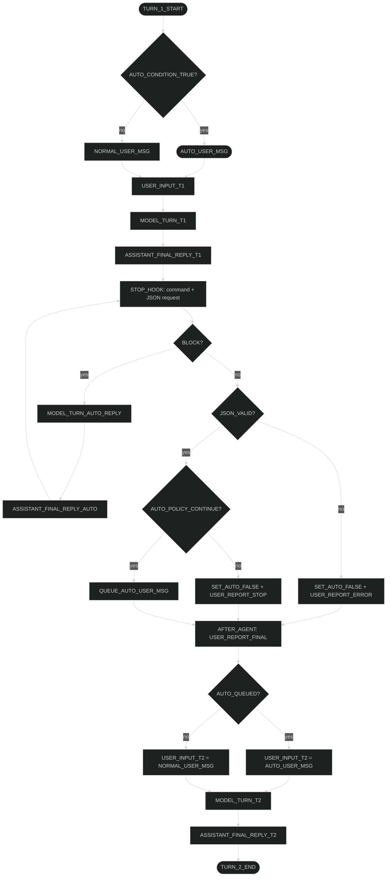

# Codex-Nero: Finalna Specyfikacja Runtime Hook (Stop-Centric)

## 1) Cel

Zbudować deterministyczny system `hook msg + hook auto`, który:

- używa natywnych mechanizmów Codexa jako podstawy,
- nie nadpisuje semantyki natywnych kolejek/hooków,
- nie używa `developer_instructions` do komend runtime,
- podejmuje jedną kontrolowaną ingerencję: automatyczne wstawienie kolejnego `AUTO_USER_MSG` po pozytywnej decyzji auto.

---

## 2) Niezmienniki architektoniczne (hard rules)

1. **Native-first, bez override**
- Nie modyfikujemy natywnej kolejki tury ani lifecycle hooków.
- Nie nadpisujemy natywnych eventów/transportu.

2. **Stop-centric control**
- Sterowanie auto-loopem (`JSON request -> parse -> continue/stop`) odbywa się w `STOP` hook.
- `AFTER_AGENT` jest kanałem raportu/telemetrii dla usera, nie kanałem komendy dla agenta.

3. **Brak runtime command przez developer_instructions**
- `developer_instructions` pozostają tylko dla statycznych zasad konfiguracji.
- Komendy „tu i teraz” idą natywną ścieżką promptową (`HookPrompt`) w `STOP`.

4. **Determinism + fail-closed**
- Parser auto działa w trybie `strict JSON`.
- Brak/invalid JSON => brak auto-kontynuacji.
- Brak spełnienia kontraktu dostawy => brak auto-kontynuacji.

---

## 3) Capability (docelowe)

## CAP-01: Agent Command Channel
- Funkcja: komenda runtime dla agenta po finalnej odpowiedzi.
- Realizacja: `STOP` hook generuje natywny `HookPrompt`.
- Warunek: bez `DeveloperInstructions::new(...)` dla runtime command.

## CAP-02: User Runtime Status Block
- Funkcja: user widzi status `msg/auto/contract/error`.
- Realizacja: natywne `HookCompleted.entries/meta` (user-visible report).
- Miejsce publikacji: po decyzji auto (zawsze), w ścieżce post-stop.

## CAP-03: Hook Auto Decision Loop
- Funkcja: wymuszenie bloku JSON, parsowanie, decyzja continue/stop.
- Realizacja: `STOP` hook + parser policy.
- Pozytywna decyzja: enqueue `AUTO_USER_MSG`.
- Negatywna decyzja: brak enqueue, status dla usera.

## CAP-04: Delivery Contract (Msg ↔ Auto)
- Funkcja: auto-kontynuacja tylko przy potwierdzonej dostawie runtime-msg.
- Realizacja: twardy gate (`contract_satisfied == true`).
- Niespełniony kontrakt => `blocked`, status dla usera, brak enqueue.

## CAP-05: Subagent Isolation
- Funkcja: brak przecieku runtime commandów do subagentów.
- Realizacja: `session_source` gating dla auto-komend i enqueue.

## CAP-06: Runtime Audit Trail
- Funkcja: pełna odtwarzalność jednej tury.
- Realizacja: log records z `thread_id`, `turn_id`, action, parse wynik, decyzja, delivery status.

## CAP-07: STOP Hook Prompt Debug Reporting
- Funkcja: jawny dev/debug raport tego, że `STOP` rzeczywiście wstrzyknął komendę do agenta przez natywny `HookPrompt`.
- Zakres: tylko ścieżka `STOP -> HookPrompt injection`; nie dotyczy `AFTER_AGENT`, które pozostaje własnym kanałem raportu/telemetrii.
- Tryby:
  - `off`: brak dodatkowego raportu debugowego.
  - `summary`: jeden user-visible komunikat, że `STOP_HOOK` wysłał prompt do agenta.
  - `full`: user-visible komunikat z pełną treścią wszystkich wstrzykniętych fragmentów promptu.
- Realizacja: user-visible `WarningEvent` emitowany wyłącznie po skutecznym zapisaniu `HookPrompt` do historii rozmowy.
- Konfiguracja: `nero.hook.runtime.stop.debug.hook_prompt_reporting = "off" | "summary" | "full"`.
- Uwaga architektoniczna: to jest capability per mechanizm `STOP`, a nie wspólny logger dla wszystkich hooków.

---

## 4) Zakres ingerencji (co wolno / czego nie wolno)

## Dozwolone
- Dodanie/utrzymanie logiki decyzyjnej `auto continue/stop`.
- Dodanie enqueue `AUTO_USER_MSG` po pozytywnej decyzji.
- Publikacja raportu dla usera przez natywne hook summary/event.
- Dodanie stop-centric dev/debug warning dla potwierdzonego `HookPrompt` injection.

## Niedozwolone
- Override natywnych kolejek i schedulerów turnów.
- Runtime command przez `developer_instructions`.
- Kaskady fallbacków semantycznych (wiele alternatywnych torów wykonania).
- Udawanie, że inne hook families (`AfterCompaction`, `SessionStart`, itd.) używają tego samego kanału co `STOP`.

---

## 5) Flow operacyjny (turn 1 -> turn 2)

---

## 6) V1 vs V2 (decyzja końcowa)

| Obszar | V1 (rozproszone) | V2 (stop-centric) |
|---|---|---|
| Gdzie wymuszamy JSON | mix custom | `STOP` |
| Gdzie decyzja continue/stop | mix custom | `STOP` |
| Komenda runtime do agenta | bywało przez dev instructions | natywny `HookPrompt` w `STOP` |
| Raport usera | częściowo rozproszony | jeden punkt publikacji po decyzji |
| Determinizm | niższy | wysoki (single path) |

---

## 7) Kryteria akceptacji

1. `STOP` może wymusić dodatkową odpowiedź agenta i robi to deterministycznie.
2. `strict JSON`: invalid/missing JSON zawsze kończy auto-kontynuację.
3. `AUTO_POLICY_CONTINUE=true` + `contract_satisfied=true` => dokładnie jeden enqueue `AUTO_USER_MSG`.
4. Każdy przebieg (success/stop/error/blocked) daje user-visible status.
5. Brak runtime `DeveloperInstructions::new(...)` dla msg/auto.
6. Subagent nie dostaje auto-commandów main-agentowych.
7. Audit trail pozwala odtworzyć przebieg turnu bez analizy kodu.

---

## 8) Non-goals

- Brak zmiany natywnego mechanizmu kolejki tur Codexa.
- Brak przebudowy całego systemu hooków upstream.
- Brak „smart fallbacków” zmieniających semantykę działania.
